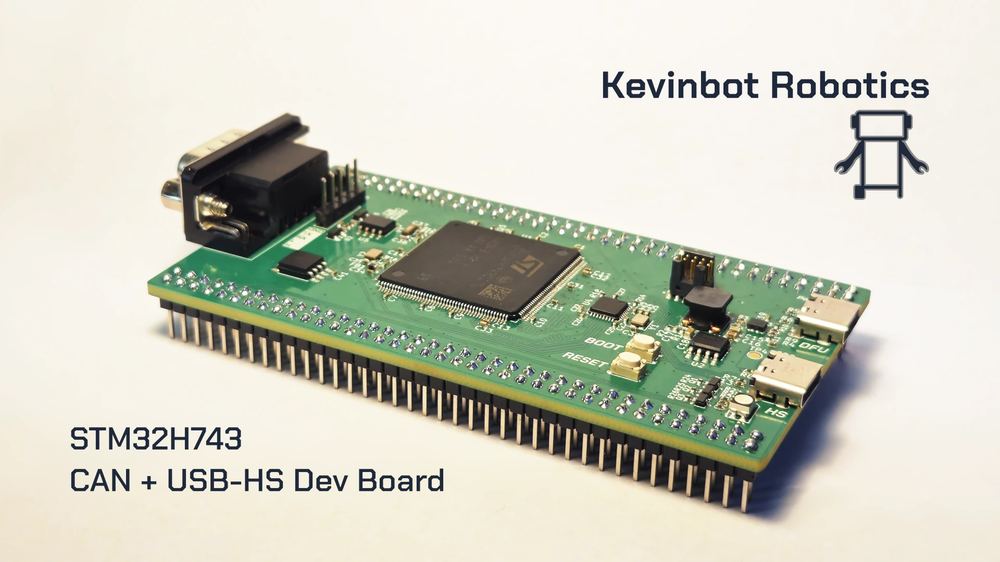

# STM32H743 CAN + USB-HS Dev Board

An STM32H743 development board with on-board USB-HS and CAN-FD (up to 8Mbit/s)

## Documentation

Docs are available on [kevinbot.net](https://kevinbot.net/dev/stm32h743-can-hs/).
Documentation is licensed under the [CC BY-SA 4.0](https://creativecommons.org/licenses/by-sa/4.0/) license.

## Features

* STM32H743
* CAN-FD using DE-9 Industrial connector
* High Speed USB 2.0 using USB3300 ULPI PHY
* 128Mbit QuadSPI NOR flash
* SWD debug using MIPI-10 Cortex Debug connector
* USB-C ports for DFU and HS
* Power path switching from HS and DFU port
* RGB LED
* Boot/Reset buttons

---

Prototypes for this project were sponsored by [PCBWay](https://www.pcbway.com/).

With their high-quality advanced PCB fabrication, fast turnaround, and excellent customer service, I recommend them for all of your PCB needs.

[Order online here, for as low at $5](https://www.pcbway.com/orderonline.aspx)
